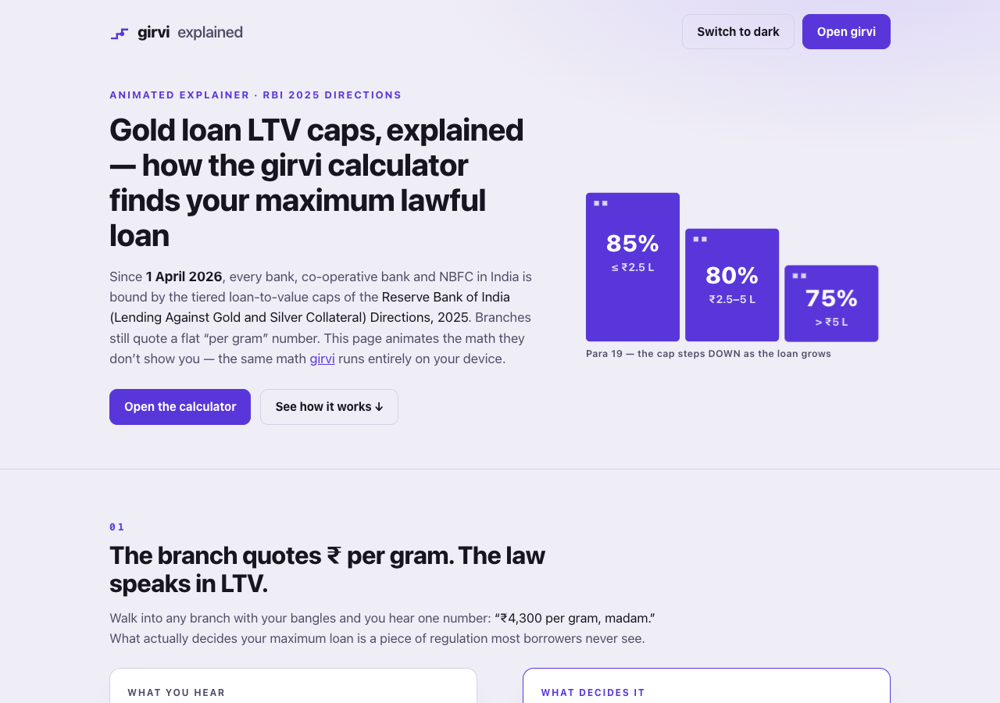

# girvi explained — how RBI's tiered gold loan LTV caps work, animated

**The branch quotes ₹ per gram. The law speaks in LTV.** This single page animates
the math behind India's gold-loan ceilings — the tiered 85/80/75% loan-to-value
staircase of the **Reserve Bank of India (Lending Against Gold and Silver
Collateral) Directions, 2025** (RBI/2025-26/47, binding on every bank, co-operative
bank and NBFC since 1 April 2026) — and shows how the
[girvi calculator](https://sreenivas-sadhu-prabhakara.github.io/girvi/) computes
your maximum lawful loan entirely on your device.

**Live:** https://sreenivas-sadhu-prabhakara.github.io/girvi-explained/
**The app it explains:** https://sreenivas-sadhu-prabhakara.github.io/girvi/



## What's on the page

- **The problem** — the flat "per gram" quote vs the Para 19 tier table that
  actually decides your maximum.
- **The staircase** — 85% up to ₹2.5 lakh, 80% to ₹5 lakh, 75% above, chosen by
  your *total* consumption loan per borrower, animated as girvi's hallmark-punched
  step motif.
- **The two plateaus** — an animated ceiling curve showing where more gold buys
  nothing (≈ ₹2,94,118–₹3,12,500 and ₹6,25,000–≈ ₹6,66,667 of collateral value),
  plus an **interactive drag-the-value demo** running the same paise-exact tier
  engine as the app.
- **Bullet vs EMI** — why Para 6(v)'s repayable-at-maturity rule makes the
  interest count against your ceiling, with the worked ₹2,00,000 @ 12% example.
- **Margin-call headroom** — Para 20's always-on cap, and the exact price fall
  that breaches it.
- **The privacy guarantee** — why there is no live gold price by design:
  `connect-src 'none'` means the browser itself blocks every network request.
- **A six-step feature tour** and a link to open girvi.

All animation is CSS + inline SVG — no libraries, no frameworks, no build step.
With `prefers-reduced-motion` (or without JavaScript) every scene renders in its
final, fully legible state.

## Quickstart

```sh
git clone https://github.com/Sreenivas-Sadhu-Prabhakara/girvi-explained.git
open girvi-explained/index.html      # or serve it: python3 -m http.server
```

Run the self-tests (Node 20+):

```sh
node --test
```

The tests prove the mini engine behind the interactive demo is the same math the
page narrates: all eight tier/plateau boundary fixtures to the rupee, the Para 17
proportionate valuation, the EMI/bullet figures shown in the bars, the 15.97%
margin-call example, and a 10,000-case seeded property test (monotonicity + the
circular tier-cap rule).

## Privacy

The page ships a Content-Security-Policy with `connect-src 'none'` — the browser
itself blocks every network request, so nothing you do here can leave your device.
The only thing stored is your light/dark preference, in this browser's
localStorage. No analytics, no fonts, no CDNs.

## Honest limits

- The ceiling girvi computes is a **legal maximum, not an offer** — lenders may
  lawfully offer less.
- The tiers apply to your **total consumption loan per borrower** (Para 19) — an
  existing gold loan can put you in a lower tier.
- The worked figures use **simple interest for bullet loans** — a labelled,
  editable assumption in the app; lenders' compounding and rests vary.
- Consumption loans against gold ornaments and coins only; income-generation and
  agri gold loans follow different norms.
- Rules verified on **2026-07-23** against the live RBI notification; the RBI may
  amend the Directions.

## Disclaimer

girvi explained is an informational page, **not financial advice** and not an
offer of credit. It renders cited provisions of the RBI 2025 Directions with a
verified-on date and never interprets beyond the published caps. Actual sanction,
valuation and pricing are the lender's decisions — verify with your bank or NBFC.
The software is provided "as is", without warranty of any kind; the authors accept
no liability for decisions made with it (see LICENSE).

## License

MIT © 2026 Sreenivas Sadhu Prabhakara
